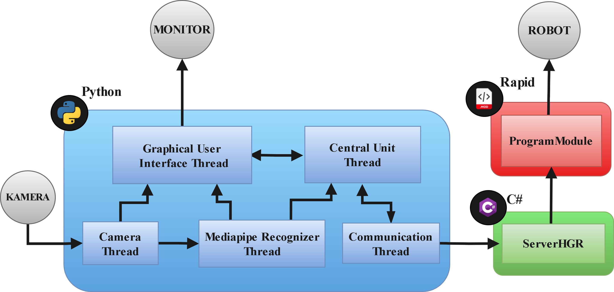

# Project_HGRsystem

Repozytorium przedstawia zestaw plików dla instancji odbiornika i serwera aplikacji do sterowania robotem przemysłowym 
wykorzystyjącej rozpoznwanie gestów dłoni.

[Instrukcja](readmeAssets/TestObsidianImp.md)

