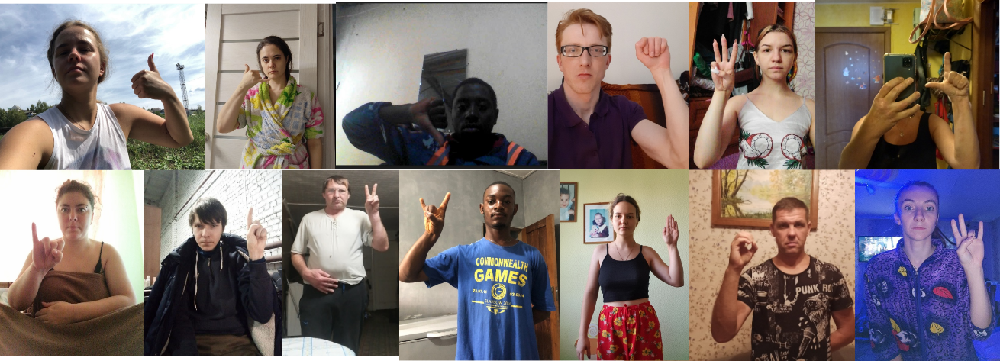
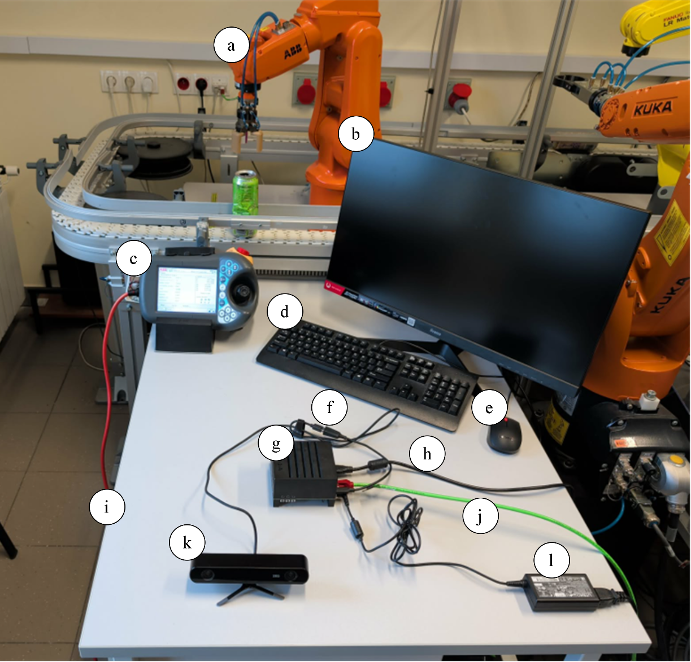
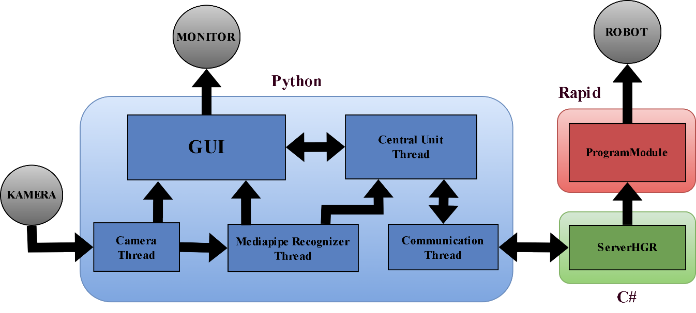
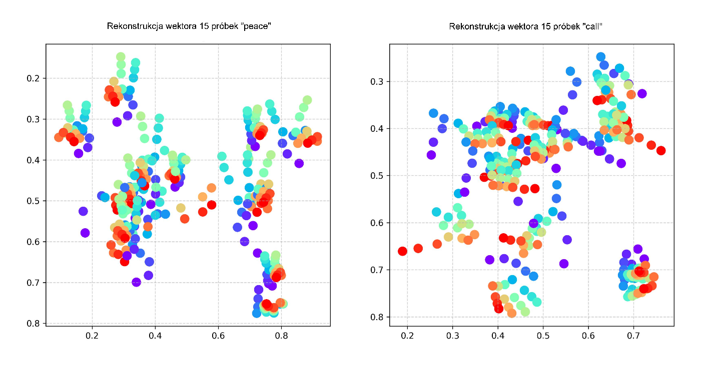
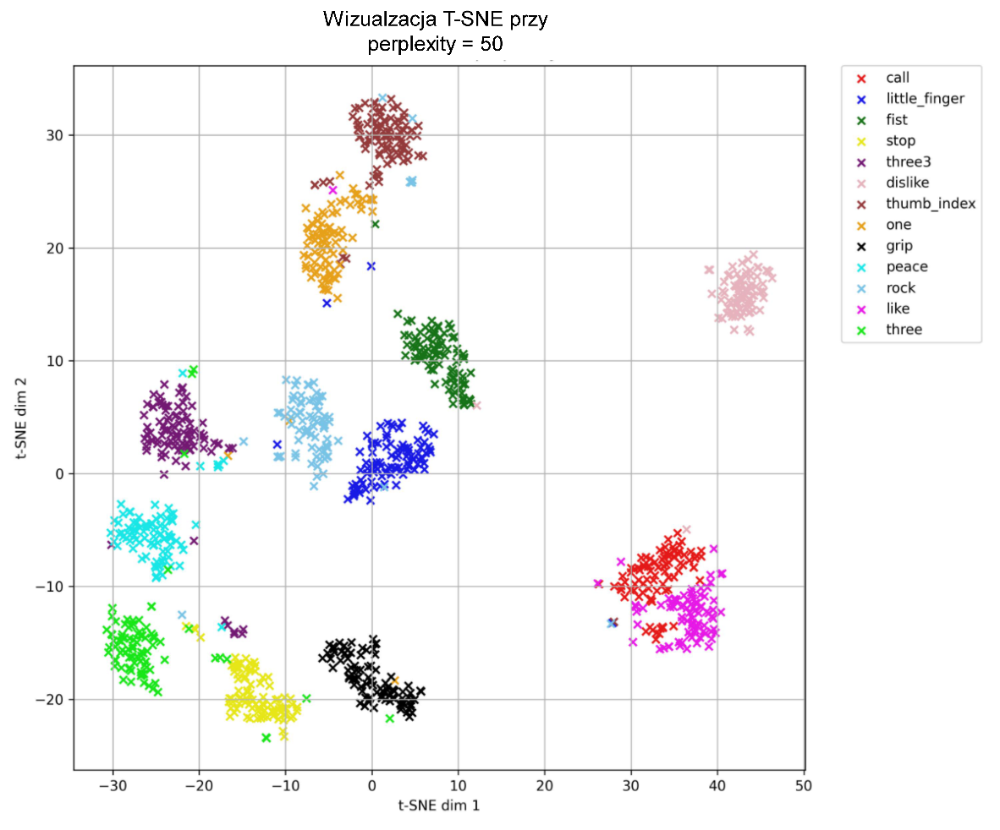
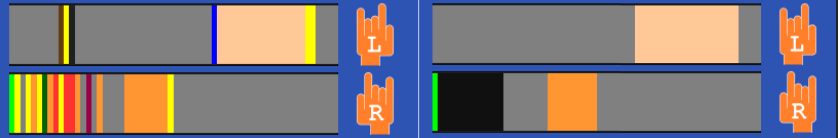
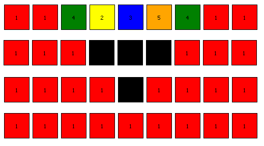

# System sterowania robotem przemysłowym za pomocą ludzkich gestów

---

## 1. Cel i idea

Głównym założeniem projektu było zintegrowanie systemu sterowania za pomocą gestów dłoni dla robota przemysłowego firmy **ABB IRB 120**.

Praca została podzielona na etapy:

- Przygotowanie danych treningowych oraz przeprowadzenie procesu uczenia modelu sieci neuronowej MLP — klasyfikatora gestów
- Opracowanie techniki wykorzystania zbioru gestów do sterowania robotem
- Zaprojektowanie GUI umożliwiającego analizę procesów sterowania i kontroli działań aplikacji
- Przeprowadzenie testów końcowych aplikacji
- Opracowanie wyników końcowych

---

## 2. Aplikacja

Opis funkcjonalności i możliwości aplikacji — główna idea działania.

*▶ Kliknij aby odtworzyć demonstrację aplikacji*

Aplikacja końcowa pozwalała użytkownikowi na działanie w:

### Interfejsie

- **Akcje ruchu** — poruszanie się w 6 kierunkach wewnątrz aplikacji: UP, DOWN, LEFT, RIGHT oraz operacje zagłębienia i wynurzenia między sekcjami
- **Akcje interakcji** — możliwość wciskania przycisków (klik, przytrzymanie), operacja Slider'a

### Komunikacji z robotem

- **Ustawienie połączenia** — konfiguracja transmisji rozkazów pomiędzy klientem–serwerem–robotem
- **Sterowanie krokowe** — nisko-prędkościowe ruchy sterujące efektorem w układzie kartezjańskim robota względem układu World
- **Uruchamianie programów robota** — startowanie, zatrzymywanie, wznawianie programów utworzonych na jednostce robota

---

Implementacja systemu sterowania wykorzystała aktywację funkcji poprzez przygotowane drzewo hierarchiczne, używające kombinacji z 2 rąk odczytujących **13 etykiet klas gestów**. Każdej ręce przydzielona została oddzielna funkcja:

- 🔵 **Dłoń lewa** — główna (niebieska) — wybór grupy poleceń
- 🟡 **Dłoń prawa** — wykonawcza (żółta) — wykonanie jednej z **28 funkcji końcowych**

[grafika wprowadzania gestów]

Wywołanie funkcji jest wynikiem zakończenia składania kolejki zapytania (sekcja różowa GUI). Gesty w systemie przekładane są na zestaw komend widocznych w kolejce zapytania oraz komendy ukryte wykonujące się w tle działania kolejki. Każdorazowa zmiana gestu otwiera proces dekodowania etykiety gestu i uruchomienia kompilatora wykonawczego. Możliwa jest zmiana poprzedniego stanu kolejki bądź powrót do wyższego stopnia polecenia.

[grafika sposobu działania kompilatora wykonawczego]

Detekcja gestów odbywa się na podstawie wytrenowanego modelu perceptronu wielowarstwowego (**3 warstwy ukryte**: 128, 128, 64 neurony) umożliwiającego klasyfikację 13 unikalnych etykiet klas gestów.

*rys. Próbka 13 klas gestów*

---

## 3. Architektura

Wykorzystane pakiety bibliotek, narzędzia, sprzęt oraz struktura aplikacji.

Aplikacja końcowa składa się z **3 warstw**:

| Warstwa | Komponenty |
|---------|-----------|
| **Klient** | Kamera stereoskopowa ZED 2, Jetson AGX Xavier |
| **Serwer** | Komputer z aplikacją serwera |
| **Robot** | Kontroler oraz jednostka robota |

### Narzędzia programistyczne

- Python 3.10
- C# Framework 4.8
- RAPID (ABB)
- MediaPipe
- TensorFlow
- NumPy, Seaborn, Matplotlib

*rys. Stanowisko projektowe*

Główny komputer odpowiadał za przetwarzanie obrazu z kamery, jego transmisję oraz operowanie GUI. Serwer wywoływał żądania sterujące poprzez pakiet **ABB PC SDK**. Kontroler robota posiadał zestaw przygotowanych programów i umożliwiał dodatkowy podgląd pracy robota dzięki Flexpendant'owi.

Programowo każdej warstwie odpowiadał oddzielny wątek wykonawczy.

*rys. Architektura softwarowa aplikacji*

Zdjęcia odczytywane z kamery ZED zostają przekonwertowane na chmurę **21 punktów charakterystycznych** poprzez model MediaPipe. Kolejno punkty zostają przetransformowane na etykietę klasy próbkowanej co **50 ms**. Dyskretny model przebiegu czasowego gestów pozwala na określenie kombinacji gestów sterujących.

W przypadku aktywacji funkcji na serwer zostaje przesłany komunikat `Command-Tag` określający komendę i zestaw argumentów. Zdekodowana wiadomość na serwerze uruchamia funkcję z pakietu ABB SDK odpowiadającą za sterowanie oraz informacje statusowe.

---

## 4. Problemy

W badaniu napotkano szereg pomniejszych problemów wymagających rozwiązania.

### (a) Przygotowanie zbioru danych testowych do modelu

W projekcie wykorzystana została otwarto-źródłowa baza zdjęć z opisanymi etykietami **HaGRIDv2** ([github.com/hukenovs/hagrid](https://github.com/hukenovs/hagrid/blob/master/README.md)). Spośród bazy wytypowano etykiety 13 gestów z próbą **2000 zdjęć na klasę**.

Problematyka pojawiła się w próbkach — zdjęcia posiadają różne skale, pozycje dłoni oraz dodatkowe niewłaściwe dłonie (ręka trzymająca telefon do zdjęcia).

Ponieważ klasyfikator gestów ma cechować się jak najwyższą niezawodnością, korelacja między danymi z populacji klasy musi być jak najwyższa. Rozwiązanie wymagało zbudowania **2 warstw**: normalizującej i filtrującej — pozwalających eliminować gesty o niższej korelacji.

*rys. Końcowa korelacja danych przedstawiona na wykresie T-SNE*

---

### (b) Aktywacja przeskoków między gestami

Do reprezentacji gestów w czasie zastosowano odwzorowanie kolorystyczne — każdemu gestowi przypisany został jeden unikalny kolor. Sterowanie odbywa się poprzez zmiany gestów, zwane **przeskokami**.

Przy zmianach gestów bądź podczas utrzymywania składnika pojawiają się różne klasyfikacje gestów, co może spowodować uruchomienie niewłaściwej funkcji aktywacyjnej — niedopuszczalne ze względów bezpieczeństwa pracy z robotem.

Przebieg dyskretny musiał zostać przekształcony do postaci bezpiecznej poprzez **operację miksowania**, ujednolicającą etykiety w czasie. Problem rozwiązano poprzez zastosowanie **deterministycznego automatu stanów**. Model iteracyjny pozwalał na wykonanie miksowania średnio w **3 iteracjach**, analizując **7 najmłodszych próbek** — aktywowany w chwili wykrycia zmiany gestu.

*rys. Przykładowy proces iteracyjny funkcji miksowania*

Zastosowanie modelu pozwala:

- Utrzymywać stan gestu
- Redukować zakłócenia
- Ujednolicać przebieg
- Przerywać pracę w przypadku zbyt wysokiego poziomu zakłóceń

Zastosowanie automatu sprowadza się do przeprowadzenia rachunku macierzowego bez potrzeby rozbudowywania bloku `if-statement` w programie.

---

### (c) Przesuwanie efektora

Projekt zakładał umożliwienie poruszania efektorem robota o minimalny krok. Stosowane sterowanie robotem odbywa się w trybie **AUTO**, co oznacza ograniczone sterowanie operatora oraz pełną prędkość robota.

W przypadku zastosowania systemu z operatorem w przestrzeni roboczej robota wymagane jest zachowanie zasad bezpieczeństwa oraz brak kolizyjności z elementami stanowiska. Ponieważ robot nie jest sterowany bezpośrednio z panelu Flexpendant, a przez sieć **TCP/IP**, pojawiają się problemy z opóźnieniami przerwania ruchu robota.

Zastosowano **2 podejścia**:

1. Ograniczenie prędkości robota do minimum
2. Zastosowanie stosu do obsługi dekrementacji ruchów

Ostatecznie flansza robota poruszała się pozornym ruchem liniowym.

---

### (d) Wielowątkowość

Obsługa GUI, komunikacja z serwerem, przetwarzanie obrazu oraz jednoczesne działanie **2 modeli klasyfikacji** powodowały znaczne obciążenie sprzętowe dla jednego wątku — głównym wyznacznikiem była szybkość transmisji obrazu i pozyskiwania etykiet klas.

Problem rozwiązano dzięki **rozbiciu struktury programu na wielowątkową**. Uzyskano:

- Płynną transmisję danych widoczną w GUI
- Nisko opóźniony proces emisji danych na serwer
